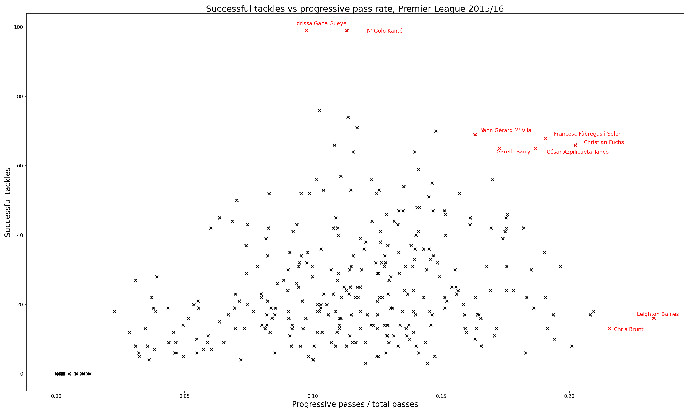

# Football Analysis
Using the statsbomb data with Python to make a few graphs. 

## Premier League 2015/16 season

<em>Successful tackles vs progressive pass rate (%). Players with highest attacking and defensive contributions are shown in red. Progressive passes are defined as passes that move the ball at least 10 metres closer to the opponent's goal. Only players with at least 400 passes in the season are considered.</em>

